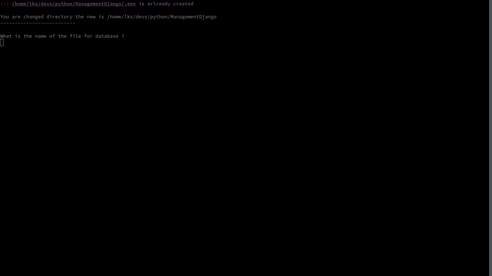
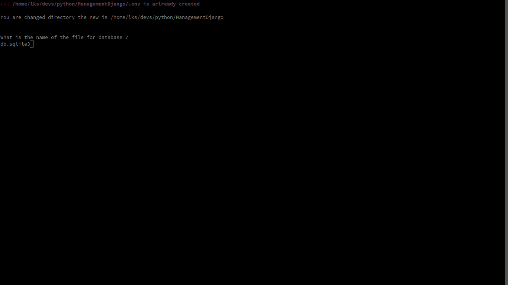

# ManageDjango - manage database sqlite3 for django 

ManageDjanogo is create in python and in bash
This is a application for you help to manage sqlite database for Django 

## Quick start

* Download the repository with the command:
`git clone git@github.com:lks2007/ManageDjango.git`

* Start command:
`python __init__.py path`

* You have this:

* Enter name of database file:
